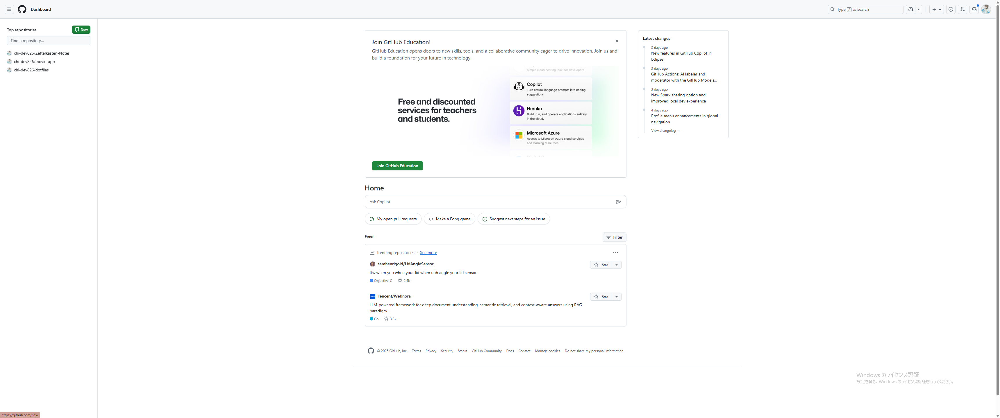

# 01. 環境構築と準備

> **対象**: Git初心者  
> **所要時間**: 30分程度

## この章で学ぶこと

- GitHubアカウントの作成
- Gitのインストール
- 初期設定
- エディタの準備

---

## 1. GitHubアカウントの作成

### 手順

1. [GitHub公式サイト](https://github.com/)にアクセス
2. 「Sign up」ボタンをクリック
3. ユーザー名、メールアドレス、パスワードを入力
4. アカウント作成を完了



### ポイント

- **ユーザー名**: 他の人にも表示される名前です。慎重に選びましょう
- **メールアドレス**: 通知やリマインダーが送信されます
- **パスワード**: 強力なパスワードを設定してください

---

## 2. Gitのインストール

### Windows

1. [Git公式サイト](https://git-scm.com/)にアクセス
2. 「Download for Windows」をクリック
3. インストーラーをダウンロードして実行
4. 基本的にはデフォルト設定で進める

### macOS

```bash
# Homebrewを使用する場合
brew install git

# または公式インストーラーを使用
# https://git-scm.com/download/mac
```

### Linux (Ubuntu/Debian)

```bash
sudo apt update
sudo apt install git
```

### インストール確認

```bash
git --version
```

**期待される結果**:
```
git version 2.40.1
```

---

## 3. Gitの初期設定

### ユーザー情報の設定

```bash
# あなたの名前を設定
git config --global user.name "あなたの名前"

# あなたのメールアドレスを設定
git config --global user.email "your-email@example.com"
```

### 設定確認

```bash
# 設定内容を確認
git config --list
```

**期待される結果**:
```
user.name=あなたの名前
user.email=your-email@example.com
```


---

## 4. エディタの準備

### 推奨エディタ

- **Visual Studio Code** (無料、初心者におすすめ)
- **Atom** (無料)
- **Sublime Text** (有料)
- **Vim/Emacs** (上級者向け)

### Visual Studio Codeのインストール

1. [VSCode公式サイト](https://code.visualstudio.com/)にアクセス
2. ダウンロードしてインストール
3. Git拡張機能をインストール（推奨）

---

## 5. 事前準備チェックリスト

学習を始める前に、以下を確認してください：

- [ ] GitHubアカウントを作成済み
- [ ] Gitをインストール済み
- [ ] Gitの初期設定を完了
- [ ] エディタをインストール済み
- [ ] ターミナル（コマンドプロンプト）が使える

---

## 次のステップ

準備が完了したら、以下のいずれかを選択してください：

- **新しくリポジトリを作成する場合**: [02_リポジトリ作成手順.md](02_リポジトリ作成手順.md)
- **既存のリポジトリに参加する場合**: [03_リポジトリクローン手順.md](03_リポジトリクローン手順.md)

---

## よくある質問

### Q: ユーザー名は後で変更できますか？
A: はい、GitHubの設定画面から変更可能です。ただし、URLが変わるため注意が必要です。

### Q: メールアドレスは公開されますか？
A: 設定により制御できます。プライベートなメールアドレスを使用することをお勧めします。

### Q: Gitのバージョンは最新である必要がありますか？
A: 基本的な操作であれば、古いバージョンでも問題ありません。ただし、最新版を使用することをお勧めします。
