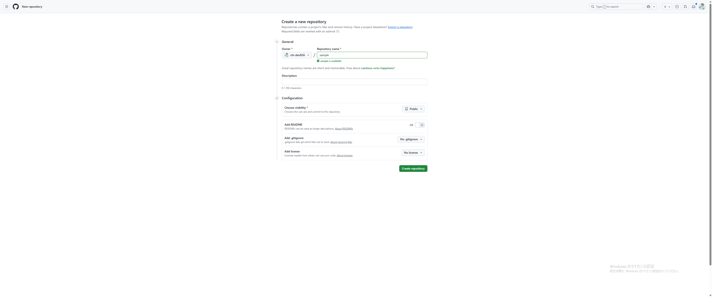
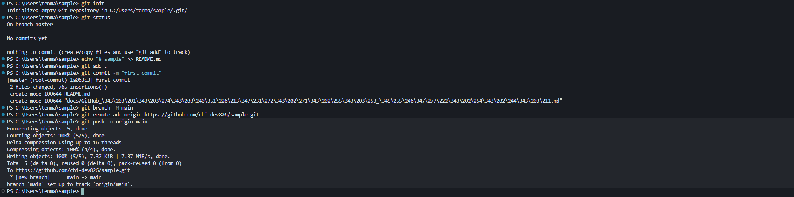

# 02. リポジトリ作成手順

> **対象**: 新しくプロジェクトを始める方  
> **所要時間**: 15分程度

## この章で学ぶこと

- GitHubでリポジトリを作成する方法
- ローカルプロジェクトをリモートリポジトリに紐づける方法
- 初回のコミットとプッシュ

---

## 1. GitHubでリポジトリを作成

### 手順

1. GitHubにログイン
2. ホーム画面の左上にある緑色の「New」ボタンをクリック
3. 「New repository」を選択


**ポイント**: ホーム画面左上の緑色の「New」ボタンからリポジトリを作成できます



### リポジトリ設定

- **Repository name**: プロジェクト名（例：`my-first-project`）
- **Description**: プロジェクトの説明（任意）
- **Public/Private**: 公開設定を選択
- **Initialize this repository with**: 
  - ✅ Add a README file（推奨）
  - ✅ Add .gitignore（推奨）
  - ✅ Choose a license（任意）

### 作成完了

「Create repository」ボタンをクリックして作成完了

---

## 2. ローカルプロジェクトをリモートリポジトリに紐づけ

### 手順1: プロジェクトフォルダの準備

```bash
# 既存のプロジェクトフォルダに移動
cd my-existing-project

# または、新しいプロジェクトフォルダを作成
mkdir my-first-project
cd my-first-project
```

### 手順2: Gitリポジトリの初期化

```bash
# Gitリポジトリを初期化
git init
```

**期待される結果**:
```
Initialized empty Git repository in /path/to/your/project/.git/
```

### 手順3: リモートリポジトリの追加

```bash
# リモートリポジトリを追加
git remote add origin https://github.com/your-username/my-first-project.git
```

**注意**: 
- `your-username`には、あなたのGitHubアカウントのユーザー名を入力してください
- `my-first-project`には、リポジトリ作成画面で設定したRepository nameを入力してください

**例**: GitHubアカウント名が`tanaka-taro`、リポジトリ名が`web-app`の場合
```bash
git remote add origin https://github.com/tanaka-taro/web-app.git
```

### 手順4: ファイルの準備と追加

#### 4-1. ファイルが存在する場合（リポジトリ作成時にオプションを有効にした場合）

```bash
# すべてのファイルをステージング
git add .

# または、特定のファイルのみ追加
git add README.md
git add src/
```

#### 4-2. ファイルが存在しない場合（リポジトリ作成時にオプションを無効にした場合）

まず、基本的なファイルを作成します：

```bash
# READMEファイルを作成
echo "# 私の最初のプロジェクト" > README.md

# プロジェクトの説明を追加
echo "" >> README.md
echo "このプロジェクトはGitの学習用です。" >> README.md

# ファイルをステージング
git add README.md
```

**または、既存のプロジェクトファイルがある場合**:
```bash
# 既存のファイルをすべてステージング
git add .

# ファイル一覧を確認
git status
```

### 手順5: 初回コミット

```bash
# 初回コミット
git commit -m "Initial commit"
```

### 手順6: メインブランチの設定とプッシュ

```bash
# メインブランチを設定
git branch -M main

# リモートにプッシュ（初回は -u オプションが必要）
git push -u origin main
```

### 参考画像



**参考**: 上記の画像は、実際のコマンド実行例です。段階的に実行してください。

---

## 3. 動作確認

### GitHubで確認

1. ブラウザでリポジトリページを更新
2. ファイルがアップロードされていることを確認
3. コミット履歴を確認

### ローカルで確認

```bash
# リモートリポジトリの設定を確認
git remote -v

# コミット履歴を確認
git log --oneline
```

**期待される結果**:
```
origin  https://github.com/your-username/my-first-project.git (fetch)
origin  https://github.com/your-username/my-first-project.git (push)
```

---

## 4. 次のステップ

リポジトリの作成が完了したら、以下を学習してください：

- [04_基本操作入門.md](04_基本操作入門.md) - 基本的なGit操作
- [05_ブランチとプルリクエスト.md](05_ブランチとプルリクエスト.md) - チーム開発の基本

---

## よくある質問

### Q: リポジトリ名は後で変更できますか？
A: はい、GitHubの設定画面から変更可能です。ただし、URLが変わるため注意が必要です。

### Q: PublicとPrivateの違いは何ですか？
A: Publicは誰でも見ることができ、Privateは招待された人のみが見ることができます。

### Q: READMEファイルは必須ですか？
A: 必須ではありませんが、プロジェクトの説明として推奨されます。

### Q: 初回のコミットでエラーが出ました
A: ユーザー情報の設定を確認してください。`git config --global user.name`と`git config --global user.email`が設定されているか確認しましょう。

### Q: リモートリポジトリのURLが分からない場合は？
A: GitHubのリポジトリページで「Code」ボタンをクリックするとURLが表示されます。

### Q: ファイルが存在しない場合はどうすればいいですか？
A: 手順4-2を参照して、基本的なファイル（README.mdなど）を作成してからコミットしてください。