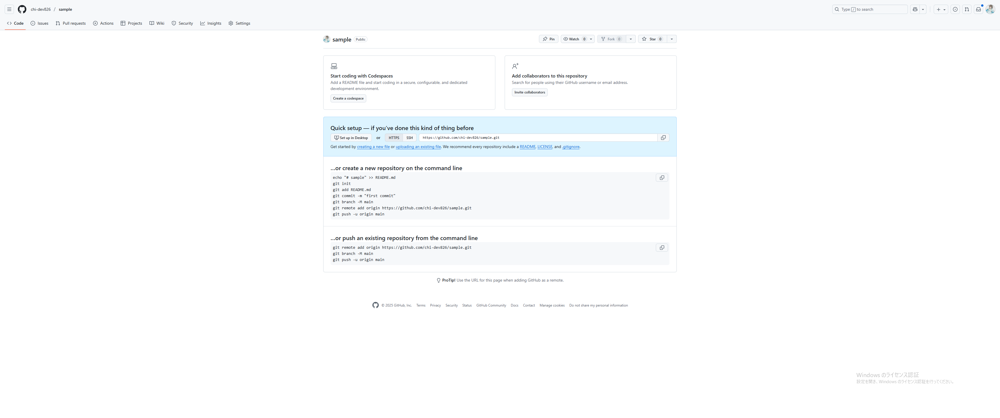

# 03. リポジトリクローン手順

> **対象**: 既存のプロジェクトに参加する方  
> **所要時間**: 10分程度

## この章で学ぶこと

- 既存のリポジトリをクローンする方法
- リモートリポジトリの確認方法
- 最新の変更を取得する方法

---

## 1. リポジトリのクローン

### 手順

1. 参加したいリポジトリのページにアクセス
2. 緑色の「Code」ボタンをクリック
3. HTTPSのURLをコピー



### ローカルにクローン

```bash
# リポジトリをクローン
git clone https://github.com/username/project-name.git

# プロジェクトフォルダに移動
cd project-name
```

### 確認

```bash
# 現在のディレクトリを確認
pwd

# ファイル一覧を確認
ls -la
```

**期待される結果**:
```
README.md
src/
docs/
.git/
```

---

## 2. リモートリポジトリの確認

### リモート設定の確認

```bash
# リモートリポジトリの設定を確認
git remote -v
```

**期待される結果**:
```
origin  https://github.com/username/project-name.git (fetch)
origin  https://github.com/username/project-name.git (push)
```

### ポイント

- `origin`はリモートリポジトリの名前（通常は変更不要）
- `fetch`は取得用、`push`は送信用のURL
- 両方とも同じURLが表示されるのが正常

---

## 3. 最新の変更を取得

### 初回の同期

```bash
# 最新の変更を取得
git pull origin main
```

**注意**: ブランチ名が`master`の場合は`git pull origin master`を使用

### 確認

```bash
# 現在のブランチを確認
git branch

# コミット履歴を確認
git log --oneline -5
```

**期待される結果**:
```
* main
```

---

## 4. ブランチの確認

### 利用可能なブランチ

```bash
# ローカルブランチを確認
git branch

# リモートブランチも含めて確認
git branch -a
```

**期待される結果**:
```
* main
  feature/login
  feature/payment
```

---

## 5. 作業開始の準備

### 新しいブランチの作成

```bash
# 新しいブランチを作成して切り替え
git checkout -b feature/my-feature

# または（新しい書き方）
git switch -c feature/my-feature
```

### 確認

```bash
# 現在のブランチを確認
git branch
```

**期待される結果**:
```
  main
* feature/my-feature
```

---

## 6. よくある操作

### メインブランチに戻る

```bash
# メインブランチに切り替え
git checkout main

# または
git switch main
```

### 最新の変更を取得

```bash
# メインブランチで最新の変更を取得
git pull origin main
```

### ブランチの削除

```bash
# ローカルブランチを削除
git branch -d feature/my-feature

# リモートブランチを削除
git push origin --delete feature/my-feature
```

---

## 7. トラブルシューティング

### エラー: `fatal: not a git repository`

**原因**: GitリポジトリでないフォルダでGitコマンドを実行

**対処法**:
```bash
# 正しいプロジェクトフォルダに移動
cd /path/to/your/project
```

### エラー: `fatal: Authentication failed`

**原因**: GitHubの認証に失敗

**対処法**:
1. GitHubのユーザー名とパスワードを確認
2. パーソナルアクセストークンを使用

### エラー: `Your local changes would be overwritten by merge`

**原因**: ローカルに未コミットの変更がある状態でプル

**対処法**:
```bash
# 変更を一時保存
git stash

# プルを実行
git pull origin main

# 保存した変更を復元
git stash pop
```

---

## 8. 次のステップ

クローンが完了したら、以下を学習してください：

- [04_基本操作入門.md](04_基本操作入門.md) - 基本的なGit操作
- [05_ブランチとプルリクエスト.md](05_ブランチとプルリクエスト.md) - チーム開発の基本

---

## よくある質問

### Q: クローンは何回も実行できますか？
A: はい、何回でも実行できます。ただし、既存のフォルダにクローンしようとするとエラーになります。

### Q: リポジトリのURLが分からない場合は？
A: リポジトリのページで「Code」ボタンをクリックするとURLが表示されます。

### Q: プライベートリポジトリの場合は？
A: GitHubの認証が必要です。ユーザー名とパスワード（またはパーソナルアクセストークン）を入力してください。

### Q: ブランチ名が分からない場合は？
A: `git branch -a`コマンドで利用可能なブランチを確認できます。
